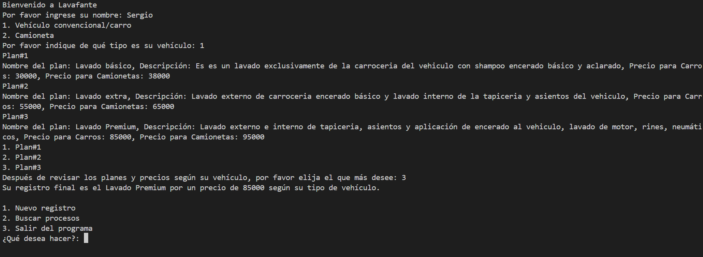

# Instrucciones de instalación y ejecución
para clonar el repositorio primero debemos tener las herramientas de git bash y de visual studio code en nuestro computador, como siguiente paso ingresaremos al link de el repositorio de github, pagina a la cual debemos entrar con una cuenta creada. Una vez dentro de la pagina y el link del repositorio, para clonarla debemos darle clic al boton verde con el nombre de code

y luego darle al boton con el número de instruccion 2 el cual copiará el link dentro de la caja de la izquierda.
El siguiente paso será abrir git bash y introducir el comando cd el cual nos introducirá a la carpeta despues nombrada como en el ejemplo

en mi caso entro por medio de documentos y ahí mismo clonamos el repositorio con el comando presentado en el ejemplo.

esto clonará el repositorio en mi caso en una carpeta en documentos llamada ProgramacionSM  para crear una carpeta propia para este tipo de documentos en git bash podemos ingresar en documentos el comando mkdir (nombre de la carpeta) y creará una carpeta y si ingresamos con cd a esta podremos clonar el repositorio ahí.

Como siguiente paso entraremos a ese repositorio usando el comando code . dentro de la carpeta donde se encuentra el repositorio, esto abrirá el programa de visual estudio code y ahí podremos editar y ejecutar todos los archivos en su interior, para ejecutar un archivo, primero instalamos una extension llamada python

luego entramos al archivo.py y oprimimos este boton el cual lo ejecutará y podremos interactuar con el código

# Uso del Programa
El uso de este programa es muy simple, entramos al archivo llamado Main.py y ejecutamos el programa, lo primero que encontraremos será la opción de ingresar nuestro nombre

despues de esto nos solicitará mencionar que tipo es nuetro carro y nos da las opciones 1 y 2 de las cuales seleccionaremos una de ellas como 1 o 2.

Al seleccionar una de las 2 se imprimirá frente al usuario 3 planes distintos con sus distintos precios para los tipos de vehiculos y las distintas descripciones que se le asignan a cada lavado, al terminar de leer los 3 planes el usuario decidirá que proceso desea realizarle a su vehiculo por lo cual al final de la explicación de los 3 planes el programa preguntará al usuario cual de los 3 planes desea y para ello los ordena del 1 al 3, el usuario debe elegir una opción del 1 al 3.

Despues de elegir el tipo de plan que el usuario desea se despliega un resultado final el cual dice el nombre del lavado y que precio es según su tipo de vehiculo.

Se depliega otro menú que pregunta al usuario que desea hacer y tiene que elegir entre el 1 y el 3 nuevamente, si elige el 1 el programa se volverá a ejecutar con los mismos pasos y volverá al mismo resultado, si elige el 2 le da la opción al usuario de buscar lavados de otros vehiculos anteriores ejecutados en el mismo programa y si elige el número 3 finalizará el programa.
# Ejemplos
### Ejemplo de funcionamiento básico

### Ejemplo funcionamiento básico y registro nuevo

### Ejemplo de busqueda de ambos registros anteriores y uno con un registro desconocido

### Ejemplo de salida del programa
